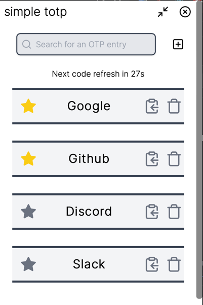

# simple totp

A simple TOTP desktop app to store and retrieve time-based 2FA codes


## Installation
Prebuilt binaries are available for Windows, MacOS and Linux. You can download the latest release from the [releases page](https://github.com/aesthetic0001/totp/releases/latest)

## Manual Build

### Preqrequisites:
- LTS [Node.js](https://nodejs.org/en/download/)
- Stable channel of Rust [rustup](https://rustup.rs/)

### Building:
1. Install node dependencies
```bash
npm install
```
2. Build the project
```bash
tauri build --release
```
3. The platform-specific binary will be available in the `src-tauri/target/release/bundle` directory